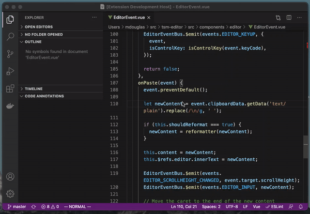

# Code Annotator

Code Annotator is an open-source extension for [Visual Studio Code](https://code.visualstudio.com) created by [Dale Cover](https://github.com/deemale) and [Mike Douglas](https://github.com/mike-douglas).

Code Annotator lets you keep notes about your code without adding TODOs and comments in your code directly. Your annotations are stored inside of the IDE and displayed in the sidebar for easy reference.

## Features

* Add/Delete annotations easily from inside of your text editor.
* Sidebar for easily navigating and seeing all of the annotations in the current file.
* Highlighting inside of the text editor when there is an annotation for the line.

### Adding an Annotation to a File

> Adding an annotation is as simple as a right-click inside of your editor.

### Browsing your Annotations

> As you browse through your file and click on a line with an annotation the sidebar will highlight the annotated line so you can more easliy see your notes.

## Known Issues

Please use [GitHub Issues](issues/).

## Release Notes

Release notes for each release of the extension!
